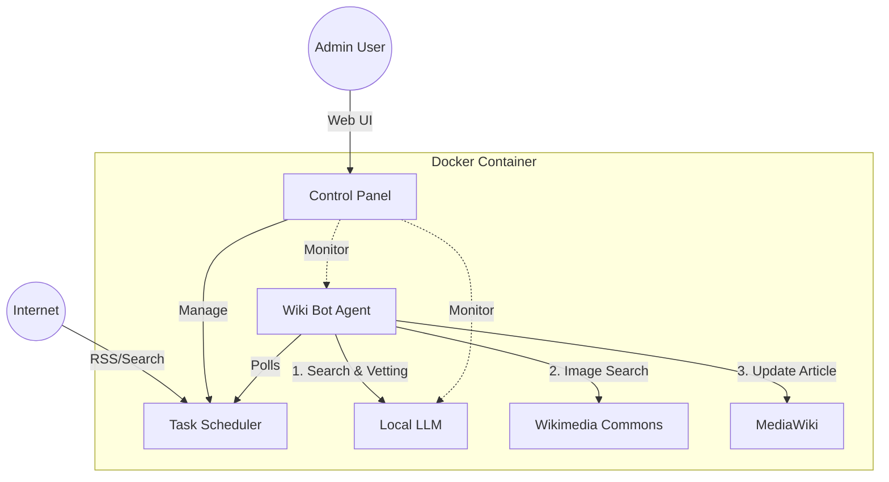

# Auto-Wiki-Brain

**自律進化型ローカルLLM知識ベースシステム**

[](LICENSE)
[](docker-compose.yml)
[](https://www.python.org/)

人間の介入を必要とせず、インターネットから自動的に情報を収集・学習し、自身の知識（Wiki記事）を更新・拡張し続ける自律型AIシステムです。

## 特徴

- 🤖 **完全自律動作**: RSS/検索APIから自動でトピックを発見し、記事を執筆
- 🧠 **ローカルLLM**: Ollama（Gemma/Llama）で外部APIコスト不要
- 📚 **Wikipedia継承**: 全Wikiデータを初期知識として搭載
- 📊 **Webダッシュボード**: リアルタイム監視・手動タスク実行
- 🖼️ **画像自動取得**: Wikimedia Commonsから適切な画像を検索・挿入

## デモ


## クイックスタート

### 必要要件

- Docker & Docker Compose
- 2GB以上の空きメモリ（LLM実行用）
- Ubuntu 20.04+ / Debian 11+ 推奨

### インストール

```bash
# リポジトリをクローン
git clone https://github.com/yourusername/auto-wiki-brain.git
cd auto-wiki-brain

# 環境変数を設定
cp .env.example .env
nano .env  # 各種パスワード・APIキーを設定

# Dockerで起動
docker-compose up -d

# ダッシュボードにアクセス
# http://localhost:8000/dashboard
# デフォルト認証: admin / secret_dashboard_pass
```

### 初回セットアップ

```bash
# MediaWikiの初期設定（ブラウザで実行）
# http://localhost:8080

# Wikipediaダンプのインポート（オプション）
docker exec -it auto-wiki-bot python src/import_wikipedia.py
```

## アーキテクチャ



## 主要機能

### 1. コントロールパネル

**URL**: `http://localhost:8000/dashboard`

- **Status Monitor**: CPU/メモリ/ディスク使用率をリアルタイム表示
- **Task Queue**: 実行中・待機中・完了済みタスクの一覧
- **Manual Trigger**: 任意キーワードで即座にタスク追加
- **Log Viewer**: 検索クエリ・吟味結果などのログ閲覧

### 2. 自動情報収集

- RSSフィードから新規トピック検出
- Google Search APIで詳細情報を取得
- LLMによる信頼性評価（Vetting）

### 3. Wiki記事執筆

- 既存記事の自動更新（差分追記）
- 新規記事の作成（テンプレート自動選択）
- 引用元URLの自動記録

## ディレクトリ構成

```
auto-wiki-brain/
├── docker-compose.yml
├── Dockerfile
├── .env.example
├── maintenance.sh
├── docs/
│   ├── ARCHITECTURE.md
│   └── images/
├── src/
│   ├── main.py
│   ├── api_server.py
│   ├── templates/
│   │   └── dashboard.html
│   ├── bot/
│   │   ├── wiki_bot.py
│   │   ├── commons.py
│   │   └── vetter.py
│   ├── scheduler/
│   │   └── task_manager.py
│   └── rag/
│       └── vector_store.py
└── data/
    ├── vector_db/
    └── logs/
```

## 設定

`.env` ファイルで以下を設定:

```bash
# MediaWiki接続
MEDIAWIKI_URL=http://mediawiki:80/api.php
MEDIAWIKI_USER=WikiBot
MEDIAWIKI_PASS=your_bot_password

# Ollama設定
OLLAMA_HOST=http://ollama:11434
OLLAMA_MODEL=gemma2:9b

# ダッシュボード認証
ADMIN_USER=admin
ADMIN_PASS=change_this_password

# 外部API（オプション）
GOOGLE_SEARCH_API_KEY=your_key_here
GOOGLE_SEARCH_CX=your_cx_here
```

## 運用

### ログの確認

```bash
docker-compose logs -f bot
```

### メンテナンススクリプト

```bash
# 定期バックアップ
./maintenance.sh backup

# ログのローテーション
./maintenance.sh rotate-logs

# データベースの最適化
./maintenance.sh optimize-db
```

### 手動タスク実行

ダッシュボードの "Manual Trigger" から、または:

```bash
curl -X POST http://localhost:8000/api/tasks \
  -u admin:your_password \
  -H "Content-Type: application/json" \
  -d '{"keyword": "量子コンピュータ"}'
```

## トラブルシューティング

### Ollamaに接続できない

```bash
# Ollamaコンテナの状態確認
docker-compose ps ollama

# ログ確認
docker-compose logs ollama

# 再起動
docker-compose restart ollama
```

### メモリ不足エラー

`docker-compose.yml` でメモリ制限を調整:

```yaml
services:
  ollama:
    deploy:
      resources:
        limits:
          memory: 4G  # 2G→4Gに増加
```

## 貢献

プルリクエスト歓迎します！以下の手順でお願いします:

1. このリポジトリをフォーク
2. フィーチャーブランチを作成 (`git checkout -b feature/amazing-feature`)
3. 変更をコミット (`git commit -m 'Add amazing feature'`)
4. ブランチをプッシュ (`git push origin feature/amazing-feature`)
5. プルリクエストを作成

## ライセンス

MIT License - 詳細は [LICENSE](LICENSE) を参照

## 謝辞

- [MediaWiki](https://www.mediawiki.org/) - Wiki エンジン
- [Ollama](https://ollama.ai/) - ローカルLLMランタイム
- [FastAPI](https://fastapi.tiangolo.com/) - Web フレームワーク

## 関連リンク

- [詳細ドキュメント](docs/ARCHITECTURE.md)
- [Issue Tracker](https://github.com/yourusername/auto-wiki-brain/issues)
- [Discussion Forum](https://github.com/yourusername/auto-wiki-brain/discussions)

---

**Note**: このプロジェクトは実験的なものです。本番環境での使用には十分なテストとセキュリティレビューを行ってください。
