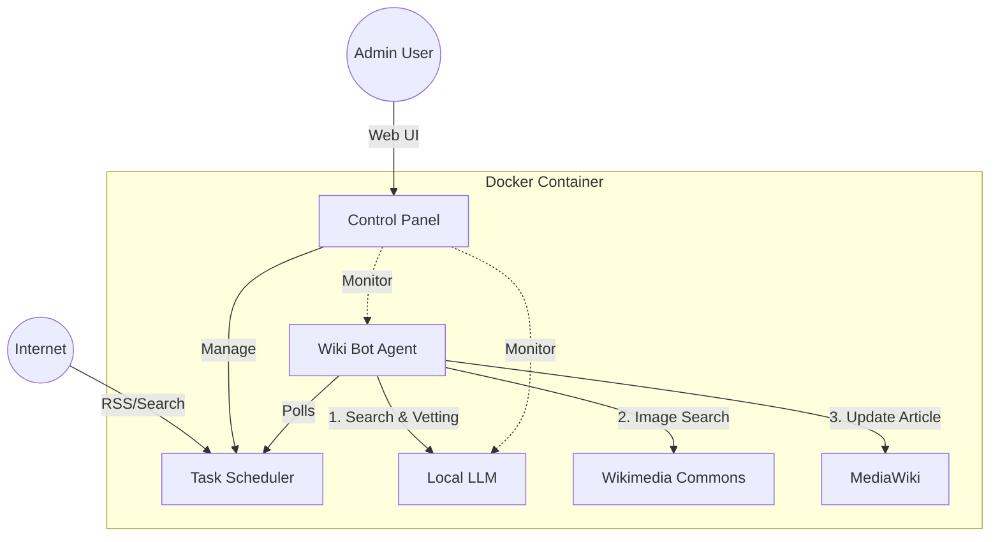

# Auto-Wiki-Brain

[English](#english) | [日本語](#japanese)

---

<a name="english"></a>
## English

**Autonomous Self-Evolving Local LLM Knowledge Base System**

[](LICENSE)
[](docker-compose.yml)
[](https://www.python.org/)

An autonomous AI system that automatically collects information from the internet, learns continuously, and updates its knowledge base (Wiki articles) without human intervention.

### Features

- 🤖 **Fully Autonomous**: Automatically discovers topics from RSS/Search APIs and writes articles
- 🧠 **Local LLM**: Uses Ollama (Gemma/Llama) with no external API costs
- 📚 **Wikipedia Integration**: Preloaded with complete Wikipedia data as initial knowledge
- 📊 **Web Dashboard**: Real-time monitoring and manual task execution
- 🖼️ **Automatic Image Retrieval**: Searches and inserts appropriate images from Wikimedia Commons

### Demo


### Quick Start

#### Requirements

- Docker & Docker Compose
- 2GB+ available memory (for LLM execution)
- Ubuntu 20.04+ / Debian 11+ recommended

#### Installation

```bash
# Clone the repository
git clone https://github.com/matsushibadenki/auto-wiki-brain.git
cd auto-wiki-brain

# Configure environment variables
cp .env.example .env
nano .env  # Set passwords and API keys

# Start with Docker
docker-compose up -d

# Access the dashboard
# http://localhost:8000/dashboard
# Default credentials: admin / secret_dashboard_pass
```

#### Initial Setup

```bash
# MediaWiki initial setup (via browser)
# http://localhost:8080

# Import Wikipedia dump (optional)
docker exec -it auto-wiki-bot python src/import_wikipedia.py
```

### Architecture


```mermaid
graph TD
    Internet((Internet)) -->|RSS/Search| Scheduler[Task Scheduler]
    AdminUser((Admin User)) -->|Web UI| Dashboard[Control Panel]
    Dashboard -->|Manage| Scheduler
    
    subgraph Docker Container
        Bot[Wiki Bot Agent] -->|Polls| Scheduler
        Bot -->|1. Search & Vetting| Ollama[Local LLM]
        Bot -->|2. Image Search| Commons[Wikimedia Commons]
        Bot -->|3. Update Article| MW[MediaWiki]
        
        Dashboard -.->|Monitor| Bot
        Dashboard -.->|Monitor| Ollama
    end
```

### Key Features

#### 1. Control Panel

**URL**: `http://localhost:8000/dashboard`

- **Status Monitor**: Real-time CPU/memory/disk usage display
- **Task Queue**: List of running, pending, and completed tasks
- **Manual Trigger**: Add tasks instantly with any keyword
- **Log Viewer**: Browse search queries, vetting results, and other logs

#### 2. Automatic Information Collection

- Detect new topics from RSS feeds
- Retrieve detailed information via Google Search API
- LLM-based reliability assessment (Vetting)

#### 3. Wiki Article Writing

- Automatic updates to existing articles (differential additions)
- Creation of new articles (automatic template selection)
- Automatic recording of source URLs

### Directory Structure

```
auto-wiki-brain/
├── docker-compose.yml
├── Dockerfile
├── .env.example
├── maintenance.sh
├── docs/
│   ├── ARCHITECTURE.md
│   └── images/
├── src/
│   ├── main.py
│   ├── api_server.py
│   ├── templates/
│   │   └── dashboard.html
│   ├── bot/
│   │   ├── wiki_bot.py
│   │   ├── commons.py
│   │   └── vetter.py
│   ├── scheduler/
│   │   └── task_manager.py
│   └── rag/
│       └── vector_store.py
└── data/
    ├── vector_db/
    └── logs/
```

### Configuration

Configure the following in `.env`:

```bash
# MediaWiki connection
MEDIAWIKI_URL=http://mediawiki:80/api.php
MEDIAWIKI_USER=WikiBot
MEDIAWIKI_PASS=your_bot_password

# Ollama settings
OLLAMA_HOST=http://ollama:11434
OLLAMA_MODEL=gemma3

# Dashboard authentication
ADMIN_USER=admin
ADMIN_PASS=change_this_password

# External APIs (optional)
GOOGLE_SEARCH_API_KEY=your_key_here
GOOGLE_SEARCH_CX=your_cx_here
```

### Operations

#### View Logs

```bash
docker-compose logs -f bot
```

#### Maintenance Scripts

```bash
# Regular backup
./maintenance.sh backup

# Log rotation
./maintenance.sh rotate-logs

# Database optimization
./maintenance.sh optimize-db
```

#### Manual Task Execution

From the dashboard's "Manual Trigger", or:

```bash
curl -X POST http://localhost:8000/api/tasks \
  -u admin:your_password \
  -H "Content-Type: application/json" \
  -d '{"keyword": "quantum computing"}'
```

### Troubleshooting

#### Cannot Connect to Ollama

```bash
# Check Ollama container status
docker-compose ps ollama

# Check logs
docker-compose logs ollama

# Restart
docker-compose restart ollama
```

#### Out of Memory Error

Adjust memory limits in `docker-compose.yml`:

```yaml
services:
  ollama:
    deploy:
      resources:
        limits:
          memory: 4G  # Increase from 2G to 4G
```

### Contributing

Pull requests are welcome! Please follow these steps:

1. Fork this repository
2. Create a feature branch (`git checkout -b feature/amazing-feature`)
3. Commit your changes (`git commit -m 'Add amazing feature'`)
4. Push to the branch (`git push origin feature/amazing-feature`)
5. Create a Pull Request

### License

MIT License - See [LICENSE](LICENSE) for details

### Acknowledgments

- [MediaWiki](https://www.mediawiki.org/) - Wiki engine
- [Ollama](https://ollama.ai/) - Local LLM runtime
- [FastAPI](https://fastapi.tiangolo.com/) - Web framework

### Related Links

- [Detailed Documentation](docs/ARCHITECTURE.md)
- [Issue Tracker](https://github.com/matsushibadenki/auto-wiki-brain/issues)
- [Discussion Forum](https://github.com/matsushibadenki/auto-wiki-brain/discussions)

---

**Note**: This project is experimental. Please conduct thorough testing and security review before production use.

---

<a name="japanese"></a>
## 日本語

**自律進化型ローカルLLM知識ベースシステム**

[](LICENSE)
[](docker-compose.yml)
[](https://www.python.org/)

人間の介入を必要とせず、インターネットから自動的に情報を収集・学習し、自身の知識（Wiki記事）を更新・拡張し続ける自律型AIシステムです。

### 特徴

- 🤖 **完全自律動作**: RSS/検索APIから自動でトピックを発見し、記事を執筆
- 🧠 **ローカルLLM**: Ollama（Gemma/Llama）で外部APIコスト不要
- 📚 **Wikipedia継承**: 全Wikiデータを初期知識として搭載
- 📊 **Webダッシュボード**: リアルタイム監視・手動タスク実行
- 🖼️ **画像自動取得**: Wikimedia Commonsから適切な画像を検索・挿入

### デモ


### クイックスタート

#### 必要要件

- Docker & Docker Compose
- 2GB以上の空きメモリ（LLM実行用）
- Ubuntu 20.04+ / Debian 11+ 推奨

#### インストール

```bash
# リポジトリをクローン
git clone https://github.com/matsushibadenki/auto-wiki-brain.git
cd auto-wiki-brain

# 環境変数を設定
cp .env.example .env
nano .env  # 各種パスワード・APIキーを設定

# Dockerで起動
docker-compose up -d

# ダッシュボードにアクセス
# http://localhost:8000/dashboard
# デフォルト認証: admin / secret_dashboard_pass
```

#### 初回セットアップ

```bash
# MediaWikiの初期設定（ブラウザで実行）
# http://localhost:8080

# Wikipediaダンプのインポート（オプション）
docker exec -it auto-wiki-bot python src/import_wikipedia.py
```

### アーキテクチャ


```mermaid
graph TD
    Internet((Internet)) -->|RSS/Search| Scheduler[Task Scheduler]
    AdminUser((Admin User)) -->|Web UI| Dashboard[Control Panel]
    Dashboard -->|Manage| Scheduler
    
    subgraph Docker Container
        Bot[Wiki Bot Agent] -->|Polls| Scheduler
        Bot -->|1. Search & Vetting| Ollama[Local LLM]
        Bot -->|2. Image Search| Commons[Wikimedia Commons]
        Bot -->|3. Update Article| MW[MediaWiki]
        
        Dashboard -.->|Monitor| Bot
        Dashboard -.->|Monitor| Ollama
    end
```

### 主要機能

#### 1. コントロールパネル

**URL**: `http://localhost:8000/dashboard`

- **Status Monitor**: CPU/メモリ/ディスク使用率をリアルタイム表示
- **Task Queue**: 実行中・待機中・完了済みタスクの一覧
- **Manual Trigger**: 任意キーワードで即座にタスク追加
- **Log Viewer**: 検索クエリ・吟味結果などのログ閲覧

#### 2. 自動情報収集

- RSSフィードから新規トピック検出
- Google Search APIで詳細情報を取得
- LLMによる信頼性評価（Vetting）

#### 3. Wiki記事執筆

- 既存記事の自動更新（差分追記）
- 新規記事の作成（テンプレート自動選択）
- 引用元URLの自動記録

### ディレクトリ構成

```
auto-wiki-brain/
├── docker-compose.yml
├── Dockerfile
├── .env.example
├── maintenance.sh
├── docs/
│   ├── ARCHITECTURE.md
│   └── images/
├── src/
│   ├── main.py
│   ├── api_server.py
│   ├── templates/
│   │   └── dashboard.html
│   ├── bot/
│   │   ├── wiki_bot.py
│   │   ├── commons.py
│   │   └── vetter.py
│   ├── scheduler/
│   │   └── task_manager.py
│   └── rag/
│       └── vector_store.py
└── data/
    ├── vector_db/
    └── logs/
```

### 設定

`.env` ファイルで以下を設定:

```bash
# MediaWiki接続
MEDIAWIKI_URL=http://mediawiki:80/api.php
MEDIAWIKI_USER=WikiBot
MEDIAWIKI_PASS=your_bot_password

# Ollama設定
OLLAMA_HOST=http://ollama:11434
OLLAMA_MODEL=gemma3

# ダッシュボード認証
ADMIN_USER=admin
ADMIN_PASS=change_this_password

# 外部API（オプション）
GOOGLE_SEARCH_API_KEY=your_key_here
GOOGLE_SEARCH_CX=your_cx_here
```

### 運用

#### ログの確認

```bash
docker-compose logs -f bot
```

#### メンテナンススクリプト

```bash
# 定期バックアップ
./maintenance.sh backup

# ログのローテーション
./maintenance.sh rotate-logs

# データベースの最適化
./maintenance.sh optimize-db
```

#### 手動タスク実行

ダッシュボードの "Manual Trigger" から、または:

```bash
curl -X POST http://localhost:8000/api/tasks \
  -u admin:your_password \
  -H "Content-Type: application/json" \
  -d '{"keyword": "量子コンピュータ"}'
```

### トラブルシューティング

#### Ollamaに接続できない

```bash
# Ollamaコンテナの状態確認
docker-compose ps ollama

# ログ確認
docker-compose logs ollama

# 再起動
docker-compose restart ollama
```

#### メモリ不足エラー

`docker-compose.yml` でメモリ制限を調整:

```yaml
services:
  ollama:
    deploy:
      resources:
        limits:
          memory: 4G  # 2G→4Gに増加
```

### 貢献

プルリクエスト歓迎します！以下の手順でお願いします:

1. このリポジトリをフォーク
2. フィーチャーブランチを作成 (`git checkout -b feature/amazing-feature`)
3. 変更をコミット (`git commit -m 'Add amazing feature'`)
4. ブランチをプッシュ (`git push origin feature/amazing-feature`)
5. プルリクエストを作成

### ライセンス

MIT License - 詳細は [LICENSE](LICENSE) を参照

### 謝辞

- [MediaWiki](https://www.mediawiki.org/) - Wiki エンジン
- [Ollama](https://ollama.ai/) - ローカルLLMランタイム
- [FastAPI](https://fastapi.tiangolo.com/) - Web フレームワーク

### 関連リンク

- [詳細ドキュメント](docs/ARCHITECTURE.md)
- [Issue Tracker](https://github.com/matsushibadenki/auto-wiki-brain/issues)
- [Discussion Forum](https://github.com/matsushibadenki/auto-wiki-brain/discussions)

---

**Note**: このプロジェクトは実験的なものです。本番環境での使用には十分なテストとセキュリティレビューを行ってください。